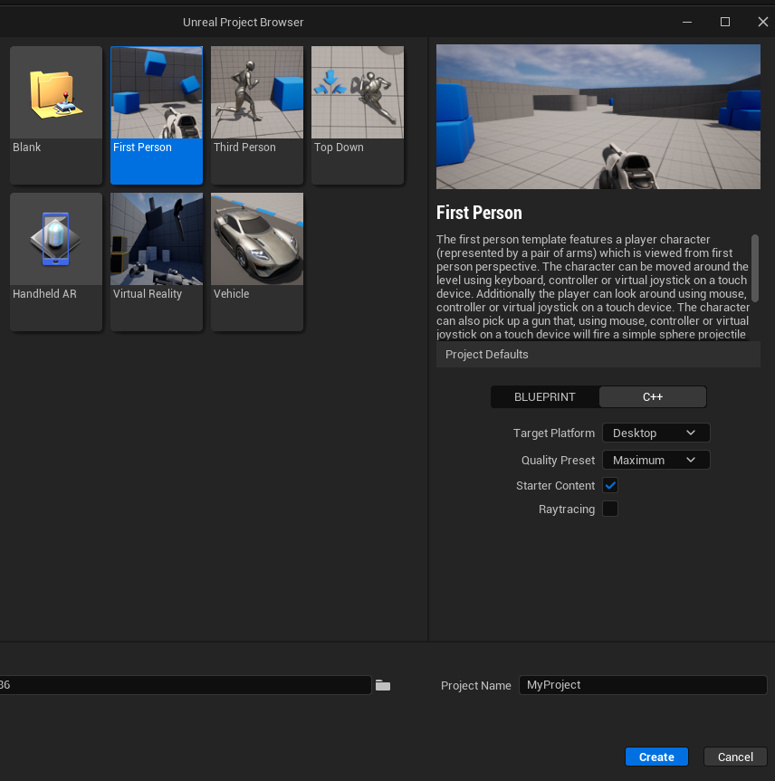
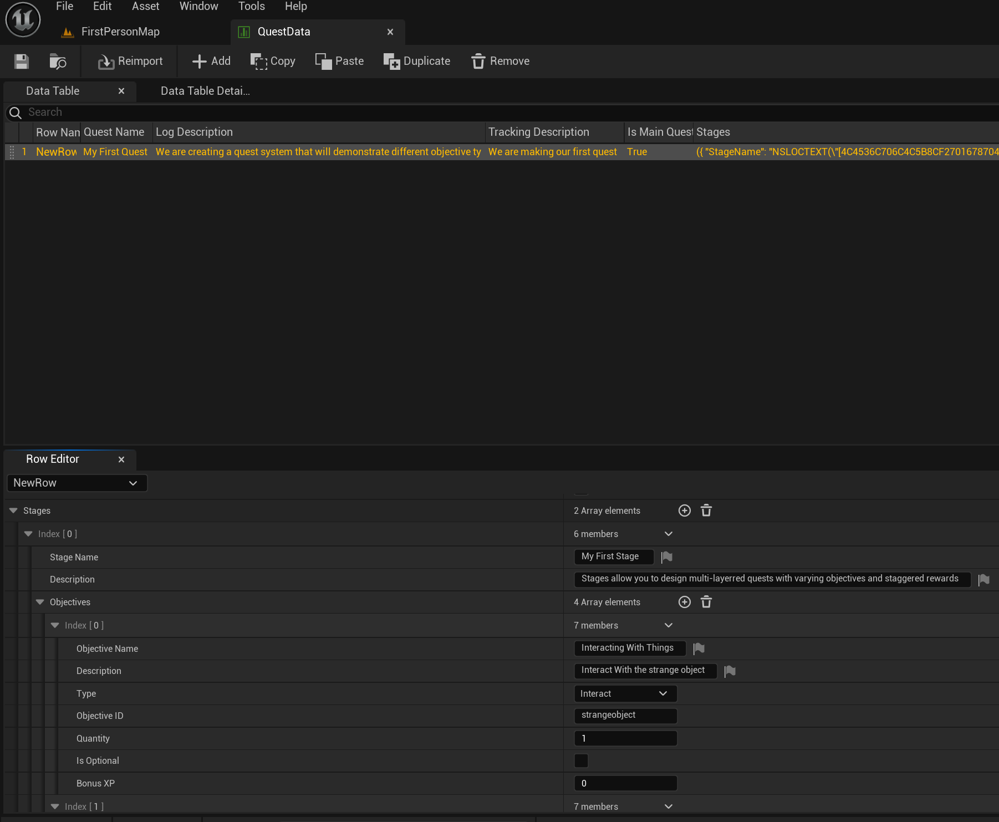
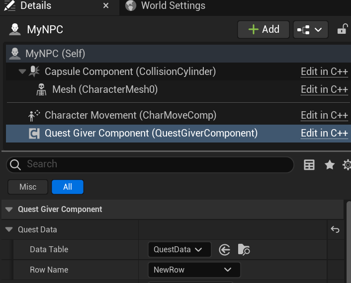
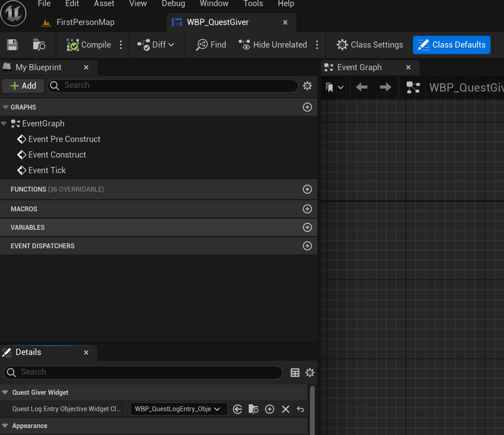
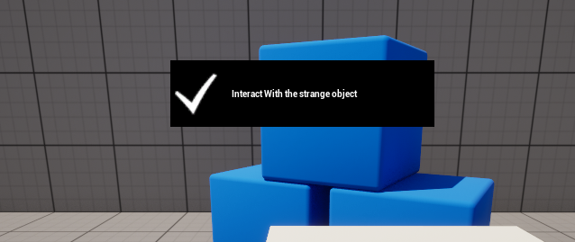
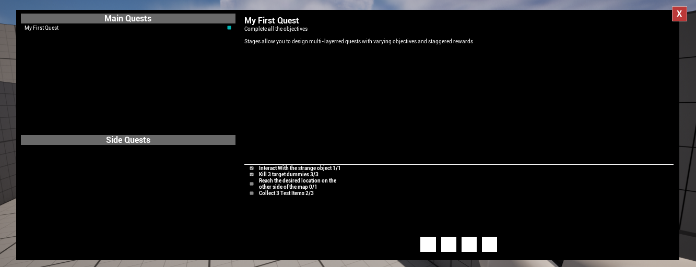

## Introduction

In order to easily understand the concepts explained in this article, it is recommended to have a basic understanding of C++ and to know your way around the Unreal Engine editor. 

A quest system can be one of the main features of a game, especially for a narrative one. My aim was to create a system similar to the one in The Witcher 3, one of my favourite games of all time. 

On the internet, you will most often come across blueprint tutorials, so i will explain how i created my project purely based on C++ and what mistakes to avoid doing.

## My initial plan 
- **Triggers:** Establishing the onset of quests
- **Quest Creation Method:** Enabling developer to create a new quest without doing any C++ work
- **Quest Display:** Utilizing a user widget class for on-screen quest visualization
- **Quest Tracking:** Updating players on their quest progress
- **Optimization and Profiling:** An area I aim to explore further

## Creating your project

I decided to use the first person template provided by the engine to bypass implementing unreleated features to the quest system. This choice was strategic, considering my intent to incorporate a 'kill' quest, a gun and projectile being absent in the third-person template. Remember to default to C++ in your project settings.



## Creating the data table

I used a data table to store the details for my quests and objectives. I started by creating a structure that derives from FTableRowBase in a class of my choosing: `struct FQuestDetails : public FTableRowBase` This is a very crucial aspect that allows the creation of a data table from that specific structure. There, i added variables for the quest name, description but also for the objectives with can be of different types such as (interact, location, kill or collect). After compiling the code, you can create the data table by right clicking on the content browser, going to miscellanouse and choosing the quest details struct.



## Making use of the data table

In the class you want to use the values from the data table, declare a variable of type `FDataTableRowHandle`. It is not necessary to initialize the data table or its row name in the constructor or anywhere in the code for that matter. To it you also add a specific property `UPROPERTY(EditInstanceOnly, BlueprintReadWrite)` which makes the variables be modifyable in the editor. 
```cpp
UPROPERTY(EditInstanceOnly, BlueprintReadWrite)
FDataTableRowHandle QuestData;

 if (QuestData.DataTable != nullptr && !QuestData.RowName.IsNone())
 {
     FString ContextString(TEXT("Quest Context"));
     FQuestDetails* DataRow = QuestData.DataTable->FindRow<FQuestDetails>("NewRow", ContextString);
     if (DataRow != nullptr)
 }
```
 Make sure that in code the name of the row is exactly as defined in the data table, in my case "NewRow", otherwise this will not work since the variables will mnot be assigned correctly.



 ## Creating an interface

 Interfaces are used when two different classes have the same functionality. In the header file there will be two classes instead of one as usual. You should live the UInterface alone and add the functions in the IInterface class. The functions need to have a default implementation: `virtual FString InteractWith() = 0;` and no variables need to be declared. Another weird, you may consider, aspect about interfaces is that even though they require a constructor, it does not need to be declared in the header file:
 ```cpp
 UInteractionInterface::UInteractionInterface(const class FObjectInitializer& ObjectInitializer)
	: Super(ObjectInitializer) {}
```
In order to make the class inherit from the interface, you include the header and write this sintax: 
```cpp
#include "InteractionInterface.h"

class QUESTSYSTEMFPP_API ANPC : public ACharacter, public IInteractionInterface
```

Don't forget to declare the functions as overrides and then you can create a declaration for them. In my case, I only need the interface for the NPC character and the object that the player interacts by pressing the "E" key. 

## My player class

For the player i created a delegate which allows me to call a certain function that i bind to my event. For this, in the header file i declare the delegate `DECLARE_DYNAMIC_MULTICAST_DELEGATE_TwoParams(FMyEvent, FString, ObjectiveID, int32, Value);` and create my variable `FMyEvent OnObjectiveIdCalled;`. In my case I use the interface for the interaction between the player and another actor, so in my in my Interact() function i broadcast the event like so `OnObjectiveIdCalled.Broadcast(ObjectiveID, 1);`. However, before broadcasting it, i make sure that the actor in front of the player implements the interface:
```cpp
void AQuestSystemFPPCharacter::Interact()
{
	if (LookAtActor && LookAtActor->GetClass()->ImplementsInterface(UInteractionInterface::StaticClass()))
	{
		IInteractionInterface* Interface = Cast<IInteractionInterface>(LookAtActor);
		if (Interface)
		{
			FString ObjectiveID = Interface->InteractWith();
			OnObjectiveIdCalled.Broadcast(ObjectiveID, 1);
		}
	}
}
```
In order to check if there is an actor in front of the player, I use LineTraceSingleByChannel() and then update the LookAtActor.

 ```cpp
FVector Start = GetActorLocation();
FVector End = Start + (GetActorForwardVector() * 200);

FHitResult HitResult;
FCollisionQueryParams CollisionParams;
CollisionParams.AddIgnoredActor(this);

bool bHit = GetWorld()->LineTraceSingleByChannel(
	HitResult,
	Start,
	End,
	ECC_Camera,
	CollisionParams
);
```

## Creating a user widget class

First of all, the design of the UI is done in the editor. Then, in the header file, every variable needs to be declared with the property UPROPERTY(meta = (BindWidget)) and named exactly as in the editor, even the horizontal boxes or spacers or other things you may add. You can assign your variables, such as the texts or buttons, in the constructor which has to be declared as protected like so `protected: virtual void NativeConstruct() override;`. For more information, you can press "F12" on  "UUserWidget" and see the entire definiton of the class. When creating a widget, besides the pointer to the class, you need to also declare a subclass of it: 
 ```cpp
class UQuestLogEntry_Objective* QuestLogEntryObjectiveWidget;

UPROPERTY(EditAnywhere, BlueprintReadWrite)
TSubclassOf<UQuestLogEntry_Objective> QuestLogEntryObjectiveWidgetClass;
```
And then create it like this in the cpp file:
 ```cpp
QuestLogEntryObjectiveWidget = CreateWidget<UQuestLogEntry_Objective>(GetWorld(), QuestLogEntryObjectiveWidgetClass);
QuestLogEntryObjectiveWidget->AddToViewport(0);
```

Don't forget to assign the parent of the widget class to be the C++ class and in the class that implements this widget to set its subclass in the blueprint.


If you want to also add widgets that are animated, you can use the animations window in the designer tab of the widget and once you're done, declare it like this:
 ```cpp
UPROPERTY(Transient, meta = (BindWidgetAnim))
UWidgetAnimation* Appear = nullptr;
```

They need to be names exactly the same as in the editor, just like the other variables. In order too check if the animation exists, you do a check and then it can be played without your editor crashing:
 ```cpp
if (Appear)
{
	PlayAnimation(Appear);
}
```

## What i ended up having

To the npc character i have attached a quest giver actor component which implements the interface and has the role of displaying the quest. In order to do that, i get the data from the data table, initialize the variables of the widget and then add it to viewport:
```cpp
void UQuestGiverComponent::DisplayQuest()
{
	if (QuestData.DataTable != nullptr && !QuestData.RowName.IsNone())
	{
		FString ContextString(TEXT("Quest Context"));
		FQuestDetails* DataRow = QuestData.DataTable->FindRow<FQuestDetails>("NewRow", ContextString);
		if (DataRow != nullptr)
		{
			if (QuestGiverWidgetClass != nullptr)
			{
				QuestGiverWidget = CreateWidget<UQuestGiverWidget>(GetOwner()->GetWorld(), QuestGiverWidgetClass);
				QuestGiverWidget->QuestID = QuestData.RowName;
				QuestGiverWidget->InitializeWithQuestGiverComponent(this);
				QuestGiverWidget->AddToViewport(0);
			}
		}
	}
}
```
I also created a quest log actor component that i attached to the player which has the role of adding new quests and spawning a AQuest_Base type of actor which check when an objective is complete and displays a notification on screen.

When displaying the objectives on screen, i check if the current objective progress contains the objective id and then use that variable to set their description.
```cpp
int32* FoundIndex = QuestActor->CurrentObjectiveProgress.Find(ObjectiveData.ObjectiveID);
if (TXT_Description && FoundIndex)
{
	FText FormattedText = FText::Format(
		NSLOCTEXT("MyNamespace", "SomeKey", "{0} {1}/{2}"),
		FText(ObjectiveData.Description),
		FText::AsNumber(*FoundIndex),
		FText::AsNumber(ObjectiveData.Quantity));
	TXT_Description->SetText(FormattedText);
}
```

For the interact type of objective, i just make use of the interface
An overview of my project 
```cpp
FString AStrangeObject::InteractWith()
{
	return FString(TEXT("strangeobject"));
}
```
For the location type of objective, i check if the actor it overlaps with is the player and then broadcast the event which updates the objective progress:
```cpp
void ALocationMarker::NotifyActorBeginOverlap(AActor* OtherActor)
{
	Super::NotifyActorBeginOverlap(OtherActor);

	AQuestSystemFPPCharacter* Character = Cast<AQuestSystemFPPCharacter>(OtherActor);
	if (Character)
	{
		Character->OnObjectiveIdCalled.Broadcast(ObjectiveID, 1);
	}
}
```

For the kill type of objective, i overrided the TakeDamage() functions in the targetdummy class and update its health. When it is less or equal to 0, i broadcast the event. In the projectile's class, i apply damage to the actor it hits.
```cpp
// inside the TargetDummy class
if (Health <= 0.0f)
{
	ACharacter* PlayerCharacter = UGameplayStatics::GetPlayerCharacter(this, 0);
	AQuestSystemFPPCharacter* MyCharacter = Cast<AQuestSystemFPPCharacter>(PlayerCharacter);
	if (MyCharacter)
	{
		MyCharacter->OnObjectiveIdCalled.Broadcast(ObjectiveID, 1);
		Destroy();
	}
}
```

```cpp
//Inside the Projectile class
APlayerController* MyPlayerController = GetWorld()->GetFirstPlayerController();
// Apply damage to the actor we hit
UGameplayStatics::ApplyDamage(
	OtherActor,      // Actor that will be damaged
	25.0f,           // Base damage to apply
	MyPlayerController, // Controller that caused the damage
	this,            // Actor that caused the damage
	nullptr          // Damage type class
);
```

Last but not least, for the collect type of objective, when the item overlaps with the player, i add it to the inventory actor component attached to it. I then broadcast the event.
```cpp
void UInventoryComponent::AddToInventory(FName Item, int32 Quantity)
{
	int32* CurrentQuantity = Content.Find(Item);
	if (CurrentQuantity)
	{
		Quantity += *CurrentQuantity;
	}
	else
	{
		Content.Add(Item, Quantity);
	}

	ACharacter* PlayerCharacter = UGameplayStatics::GetPlayerCharacter(this, 0);
	AQuestSystemFPPCharacter* MyCharacter = Cast<AQuestSystemFPPCharacter>(PlayerCharacter);
	if (MyCharacter)
	{
		MyCharacter->OnObjectiveIdCalled.Broadcast(Item.ToString(), Quantity);
	}
}
```

## The final picture




I used this [tutorial](https://www.youtube.com/playlist?list=PL4G2bSPE_8unYoX6G_UUE5QIzbySCUR_8) as a reference which was made in blueprint.

[Unreal Engine forums](https://forums.unrealengine.com/categories?tag=unreal-engine) is another website I used frequently to ask questions.

Whenever i was unsure about a function's implementation, I would search it in the [Unreal Engine documentation](https://docs.unrealengine.com/5.3/en-US/).

